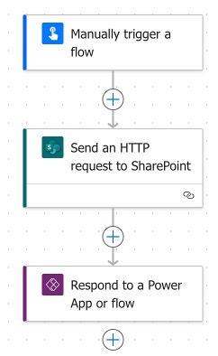

# Update "Created by" in a Microsoft List

## Summary


 


This Power Automate flow updates the “Created By” field of a Microsoft List item, replacing the account with a specified user based on their email address, using an HTTP request to SharePoint.



## Wiki

You can find the wiki [here](https://github.com/Glynnryan/Power-Platform/wiki/Update-%22Created-by%22-in-a-Microsoft-List#post-script).

## Version history

| Version | Date               | Comments        |
| ------- | ------------------ | --------------- |
| 1.0.0.0 | September 18, 2024 | Initial release |

### Using the solution zip

* [Download](./solution/UpdateCreatedBy_1_0_0_1.zip) the `.zip` from the `solution` folder
* Within **Power Apps Studio**, import the solution `.zip` file using **Solutions** > **Import Solution** and select the `.zip` file you just packed.
* Open the app in edit mode and make sure the data source **Data source name** is connected correctly.

### Using the source code

You can also use the [Power Apps CLI](https://docs.microsoft.com/powerapps/developer/data-platform/powerapps-cli) to pack the source code by following these steps:

* Clone the repository to a local drive
* Pack the source files back into a solution `.zip` file:

  ```bash
  pac solution pack --zipfile pathtodestinationfile --folder pathtosourcefolder --processCanvasApps
  ```

  Making sure to replace `pathtosourcefolder` to point to the path to this sample's `sourcecode` folder, and `pathtodestinationfile` to point to the path of this solution's `.zip` file (located under the `solution` folder)
* Within **Power Apps Studio**, import the solution `.zip` file using **Solutions** > **Import Solution** and select the `.zip` file you just packed.


## Post Script

I stumbled onto a Microsoft Community post titled "[Update 'Created By' and 'Modified By' fields.](https://techcommunity.microsoft.com/t5/power-apps-and-power-automate-in/update-created-by-and-modified-by-fields/m-p/3672675/highlight/true#M6072)", with an answer by [Rob Elliott](https://techcommunity.microsoft.com/t5/user/viewprofilepage/user-id/174092#profile) which gave me the idea and framework for my solution.

### Acknowledgements

- [Rob Elliott](https://techcommunity.microsoft.com/t5/user/viewprofilepage/user-id/174092#profile)

## Disclaimer

**THIS CODE IS PROVIDED *AS IS* WITHOUT WARRANTY OF ANY KIND, EITHER EXPRESS OR IMPLIED, INCLUDING ANY IMPLIED WARRANTIES OF FITNESS FOR A PARTICULAR PURPOSE, MERCHANTABILITY, OR NON-INFRINGEMENT.**
